# Event Flow Analysis - Event Storming Documentation

> **Event Storming** is a collaborative modeling technique that helps teams understand complex business domains by focusing on domain events. This document applies Event Storming methodology to analyze our Task Management System's event flow.

## Table of Contents

1. [Introduction to Event Storming](#introduction-to-event-storming)
2. [Task Management Domain Events](#task-management-domain-events)
3. [Event Flow Diagram](#event-flow-diagram)
4. [Domain Analysis](#domain-analysis)
5. [Event Timeline Breakdown](#event-timeline-breakdown)
6. [Bounded Contexts](#bounded-contexts)
7. [Aggregates and Commands](#aggregates-and-commands)
8. [Implementation Mapping](#implementation-mapping)

## Introduction to Event Storming

**Event Storming** is a workshop format for rapidly exploring complex business domains by focusing on **domain events** - meaningful occurrences that domain experts care about. 

### Key Principles Applied

- **Start with Events**: What really happens in our task management domain?
- **Use Business Language**: Events are named in terms domain experts understand
- **Focus on the Past**: Events describe what has already happened
- **Visualize the Flow**: Timeline shows the sequence of business events
- **Collaborative Discovery**: Input from multiple perspectives (developers, business users, domain experts)

### Color Convention Used

Following standard Event Storming notation:

- 🟠 **Orange**: Domain Events (past tense, business meaningful)
- 🔵 **Light Blue**: Commands (actions that trigger events)
- 🟡 **Yellow**: Actors/Users (who performs commands)
- 🟡 **Yellow**: Aggregates (business entities that enforce rules)
- 🟢 **Green**: Read Models/Views (information needed for decisions)
- 🟣 **Purple**: Policies (reactive logic after events)
- 🔴 **Red**: Issues/Questions (to be resolved)
- 🩷 **Pink**: External Systems (external event sources)

## Task Management Domain Events

### Primary Domain Events Discovered

Our Event Storming session identified these key domain events in chronological order:

1. **TaskCreated** - A new task has been created in the system
2. **TaskStatusChanged** - A task's status has been modified
3. **TaskCompleted** - A task has been marked as completed
4. **TaskUpdated** - Task details (title/description) have been modified
5. **TaskDeleted** - A task has been removed from the system

### Event Characteristics

Each event captures:
- **What happened** (business action)
- **When it happened** (timestamp)
- **Who was involved** (user/actor)
- **Business context** (relevant domain data)

## Event Flow Diagram

```mermaid
graph TD
    %% Actors
    User["👤 User<br/>🟡"]
    System["🔧 System<br/>🩷"]
    
    %% Commands
    CreateTask["Create Task<br/>🔵"]
    UpdateTask["Update Task<br/>🔵"]
    CompleteTask["Complete Task<br/>🔵"]
    DeleteTask["Delete Task<br/>🔵"]
    
    %% Domain Events (in timeline order)
    TaskCreated["TaskCreated<br/>🟠<br/>📅 Event 1"]
    TaskStatusChanged["TaskStatusChanged<br/>🟠<br/>📅 Event 2"]
    TaskCompleted["TaskCompleted<br/>🟠<br/>📅 Event 3"]
    TaskUpdated["TaskUpdated<br/>🟠<br/>📅 Event 4"]
    TaskDeleted["TaskDeleted<br/>🟠<br/>📅 Event 5"]
    
    %% Aggregates
    TaskAggregate["Task<br/>🟡<br/>Aggregate Root"]
    
    %% Read Models
    TaskListView["Task List View<br/>🟢"]
    TaskDetailView["Task Detail View<br/>🟢"]
    UserDashboard["User Dashboard<br/>🟢"]
    
    %% Policies
    NotificationPolicy["Notify on Completion<br/>🟣<br/>whenever TaskCompleted"]
    AnalyticsPolicy["Track User Activity<br/>🟣<br/>whenever any TaskEvent"]
    
    %% External Systems
    EmailService["Email Service<br/>🩷"]
    AnalyticsService["Analytics Service<br/>🩷"]
    
    %% Command to Event Flow
    User --> CreateTask
    CreateTask --> TaskAggregate
    TaskAggregate --> TaskCreated
    
    User --> UpdateTask
    UpdateTask --> TaskAggregate
    TaskAggregate --> TaskStatusChanged
    TaskAggregate --> TaskUpdated
    
    User --> CompleteTask
    CompleteTask --> TaskAggregate
    TaskAggregate --> TaskStatusChanged
    TaskAggregate --> TaskCompleted
    
    User --> DeleteTask
    DeleteTask --> TaskAggregate
    TaskAggregate --> TaskDeleted
    
    %% Event to Read Model Flow
    TaskCreated --> TaskListView
    TaskCreated --> UserDashboard
    TaskStatusChanged --> TaskDetailView
    TaskCompleted --> TaskDetailView
    TaskCompleted --> UserDashboard
    TaskUpdated --> TaskDetailView
    TaskDeleted --> TaskListView
    
    %% Policy Reactions
    TaskCompleted --> NotificationPolicy
    NotificationPolicy --> EmailService
    
    TaskCreated --> AnalyticsPolicy
    TaskStatusChanged --> AnalyticsPolicy
    TaskCompleted --> AnalyticsPolicy
    TaskUpdated --> AnalyticsPolicy
    TaskDeleted --> AnalyticsPolicy
    AnalyticsPolicy --> AnalyticsService
    
    %% Styling
    classDef eventStyle fill:#FFA500,stroke:#000,stroke-width:2px,color:#000
    classDef commandStyle fill:#87CEEB,stroke:#000,stroke-width:2px,color:#000
    classDef actorStyle fill:#FFFF99,stroke:#000,stroke-width:2px,color:#000
    classDef aggregateStyle fill:#FFFF99,stroke:#000,stroke-width:3px,color:#000
    classDef readModelStyle fill:#90EE90,stroke:#000,stroke-width:2px,color:#000
    classDef policyStyle fill:#DDA0DD,stroke:#000,stroke-width:2px,color:#000
    classDef externalStyle fill:#FFB6C1,stroke:#000,stroke-width:2px,color:#000
    
    class TaskCreated,TaskStatusChanged,TaskCompleted,TaskUpdated,TaskDeleted eventStyle
    class CreateTask,UpdateTask,CompleteTask,DeleteTask commandStyle
    class User actorStyle
    class TaskAggregate aggregateStyle
    class TaskListView,TaskDetailView,UserDashboard readModelStyle
    class NotificationPolicy,AnalyticsPolicy policyStyle
    class EmailService,AnalyticsService,System externalStyle
```



## Domain Analysis

### Business Process Flow

The Event Storming revealed this primary business process:

```
User Intent → Command → Aggregate → Domain Event(s) → Policies → External Actions
```

### Key Insights Discovered

1. **Single Command, Multiple Events**: When completing a task, we generate both `TaskStatusChanged` and `TaskCompleted` events
2. **Event Granularity**: We maintain both generic (`TaskStatusChanged`) and specific (`TaskCompleted`) events for different consumers
3. **Policy-Driven Reactions**: Events trigger automated policies for notifications and analytics
4. **Read Model Updates**: Events update various user-facing views

## Event Timeline Breakdown

### Scenario: User Creates and Completes a Task

**Timeline Analysis** (following Event Storming chronological approach):

```
T1: User Issues "Create Task" Command
    ↓
T2: TaskCreated Event Emitted
    → Updates: Task List View, User Dashboard
    → Triggers: Analytics Policy
    
T3: User Issues "Complete Task" Command  
    ↓
T4: TaskStatusChanged Event Emitted
    → Updates: Task Detail View
    → Triggers: Analytics Policy
    
T5: TaskCompleted Event Emitted (same command)
    → Updates: Task Detail View, User Dashboard
    → Triggers: Notification Policy, Analytics Policy
    
T6: Notification Policy Reacts
    → Sends completion notification via Email Service
    
T7: Analytics Policy Reacts
    → Tracks events in Analytics Service
```

### Why 3 Events in Our Test?

From `test_domain_verification`, we see exactly this pattern:

1. **TaskCreated** (T2) - Generated during task creation with `PENDING` status
2. **TaskStatusChanged** (T4) - Generated when status changes from `PENDING` to `COMPLETED`  
3. **TaskCompleted** (T5) - Generated as a business-specific completion event

This follows Event Storming principles of capturing both **technical state changes** and **business-meaningful events**.

## Bounded Contexts

### Task Management Context

**Bounded Context**: Task Management
- **Entities**: Task
- **Value Objects**: TaskId, UserId, TaskStatus
- **Events**: TaskCreated, TaskCompleted, TaskStatusChanged, TaskUpdated, TaskDeleted
- **Commands**: CreateTask, CompleteTask, UpdateTask, DeleteTask
- **Policies**: NotificationPolicy, AnalyticsPolicy

**Language**: 
- "Task" - A unit of work assigned to a user
- "Complete" - Mark a task as finished
- "Status" - Current state of task progress
- "Owner" - User responsible for the task

### Integration Contexts

**Notification Context**:
- **External System**: Email Service
- **Events Consumed**: TaskCompleted
- **Language**: "notification", "recipient", "template"

**Analytics Context**:
- **External System**: Analytics Service  
- **Events Consumed**: All Task Events
- **Language**: "metric", "tracking", "user behavior"

## Aggregates and Commands

### Task Aggregate

**Aggregate Root**: Task
**Responsibilities**:
- Enforce business rules (title validation, status transitions)
- Emit domain events for state changes
- Maintain task lifecycle integrity

**Commands Handled**:
- `CreateTask` → `TaskCreated`
- `UpdateTaskStatus` → `TaskStatusChanged` + `TaskCompleted` (if completing)
- `UpdateTaskDetails` → `TaskUpdated`
- `DeleteTask` → `TaskDeleted`

**Business Rules Enforced**:
- Task title cannot be empty or > 200 characters
- Only PENDING/IN_PROGRESS tasks can be completed
- Status changes must be valid transitions

### Event Flow Pattern

```
Command → [Business Rules Check] → State Change → Event(s) → Policy Reactions
```

## Implementation Mapping

### From Event Storming to Code

**Event Storming Artifact** → **Code Implementation**

| Event Storming Element | Code Implementation | File Location |
|------------------------|-------------------|---------------|
| 🟠 Domain Events | `DomainEvent` classes | `src/domain/events/` |
| 🔵 Commands | Use case classes | `src/application/use_cases/` |
| 🟡 Task Aggregate | `Task` entity | `src/domain/entities/task.py` |
| 🟣 Policies | Event handlers | `src/adapters/events/` |
| 🟢 Read Models | API responses | `src/adapters/api/` |
| 🩷 External Systems | Infrastructure adapters | `src/infrastructure/` |

### Event Sourcing Alignment

Our Event Storming naturally aligns with Event Sourcing:

1. **Events as First-Class Citizens**: Events discovered in storming become stored events
2. **Business Language**: Event names use domain terminology 
3. **State Reconstruction**: Current state derived from event history
4. **Audit Trail**: Complete business history captured in events

### Benefits Realized

**From Event Storming Approach**:
- ✅ **Shared Understanding**: Clear picture of what happens in the domain
- ✅ **Business Alignment**: Events reflect real business occurrences  
- ✅ **Implementation Guide**: Clear path from domain to code
- ✅ **Future Extensibility**: Easy to add new events and policies
- ✅ **Debugging Clarity**: Event log tells the complete business story

### Questions for Future Sessions

🔴 **Issues to Explore** (Red Stickies):
- Should we have events for task assignment to other users?
- How do we handle task dependencies and blocked states?
- What about recurring tasks or task templates?
- Should task priority changes emit events?
- How do we handle bulk operations (complete multiple tasks)?

---

*This Event Storming analysis provides the foundation for understanding our task management system's event-driven architecture. The visual timeline helps both technical and business stakeholders understand what happens, when it happens, and why it matters to the business.* 