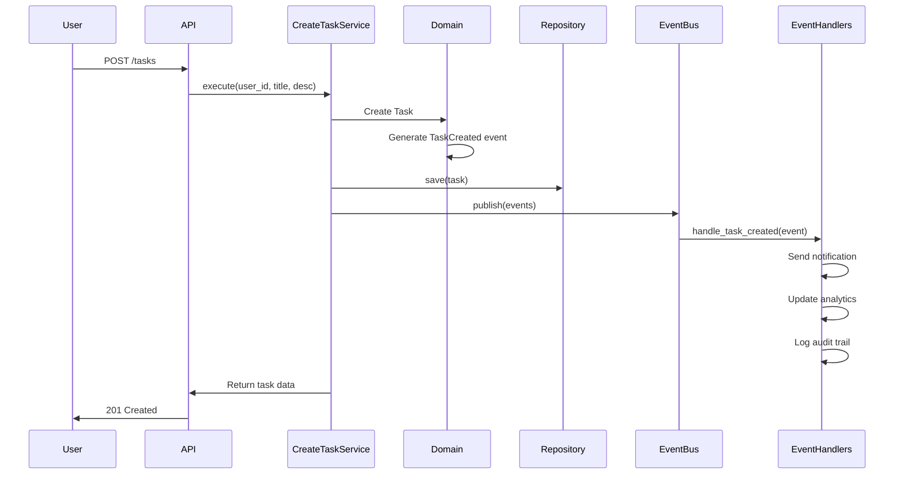
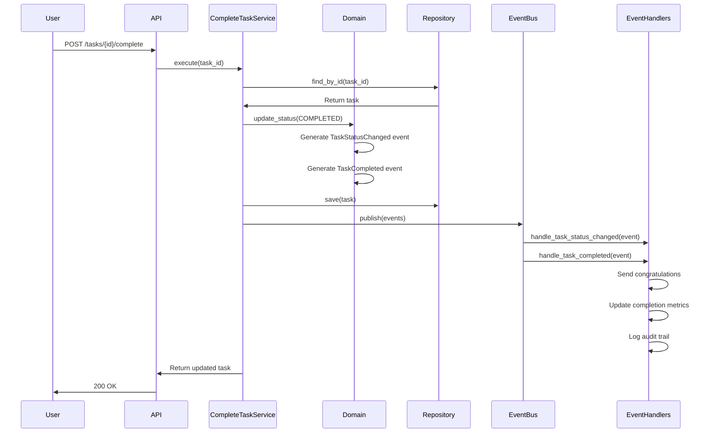

# Event Flow Documentation

> **Comprehensive guide to understanding how domain events flow through the Task Management System.**

This document explains the event-driven architecture and how domain events are generated, published, and consumed throughout the system.

## 📋 Table of Contents

- [Overview](#overview)
- [Event Flow Architecture](#event-flow-architecture)
- [Domain Events](#domain-events)
- [Event Publishing](#event-publishing)
- [Event Consumption](#event-consumption)
- [Event Flow Diagrams](#event-flow-diagrams)
- [Testing Event Flow](#testing-event-flow)

---

## 🎯 Overview

The Task Management System uses **Event-Driven Architecture** to decouple components and enable asynchronous processing. Domain events represent something that happened in the business domain and trigger subsequent actions.

### Key Benefits

- ✅ **Loose Coupling** - Components don't need to know about each other
- ✅ **Scalability** - Events can be processed asynchronously
- ✅ **Extensibility** - New event handlers can be added without changing existing code
- ✅ **Audit Trail** - All business events are recorded for compliance

---

## 🏗️ Event Flow Architecture

### High-Level Flow

```
┌─────────────────┐    ┌─────────────────┐    ┌─────────────────┐
│   API Request   │───>│  Application    │───>│   Domain Layer  │
│                 │    │    Service      │    │                 │
└─────────────────┘    └─────────────────┘    └─────────────────┘
                                │                       │
                                ▼                       ▼
                       ┌─────────────────┐    ┌─────────────────┐
                       │   Event Bus     │<───│  Domain Events  │
                       │                 │    │                 │
                       └─────────────────┘    └─────────────────┘
                                │
                                ▼
                       ┌─────────────────┐    ┌─────────────────┐
                       │   Event         │───>│   Event         │
                       │   Handlers      │    │   Consumers     │
                       └─────────────────┘    └─────────────────┘
```

### Detailed Flow

1. **API Request** - User makes request to create/update/complete task
2. **Application Service** - Orchestrates the business use case
3. **Domain Layer** - Executes business logic and generates domain events
4. **Event Bus** - Publishes events to all subscribers
5. **Event Handlers** - Process events and trigger side effects
6. **Event Consumers** - Handle long-running processes (notifications, analytics, etc.)

---

## 📢 Domain Events

### Event Types

#### 1. TaskCreated Event

**Triggered when:** A new task is created
**Contains:**
- `event_id` - Unique event identifier
- `timestamp` - When the event occurred
- `aggregate_id` - Task ID
- `task_title` - Title of the created task
- `user_id` - ID of the user who created the task

**Example:**
```python
TaskCreated(
    event_id="evt-123",
    timestamp=datetime.now(timezone.utc),
    aggregate_id="task-456",
    task_title="Learn Domain Design",
    user_id="user-789"
)
```

#### 2. TaskStatusChanged Event

**Triggered when:** Task status is updated
**Contains:**
- `event_id` - Unique event identifier
- `timestamp` - When the event occurred
- `aggregate_id` - Task ID
- `old_status` - Previous status
- `new_status` - New status
- `task_title` - Title of the task

**Example:**
```python
TaskStatusChanged(
    event_id="evt-124",
    timestamp=datetime.now(timezone.utc),
    aggregate_id="task-456",
    old_status="pending",
    new_status="in_progress",
    task_title="Learn Domain Design"
)
```

#### 3. TaskCompleted Event

**Triggered when:** Task is marked as completed
**Contains:**
- `event_id` - Unique event identifier
- `timestamp` - When the event occurred
- `aggregate_id` - Task ID
- `task_title` - Title of the completed task
- `user_id` - ID of the user who completed the task
- `completed_at` - When the task was completed

**Example:**
```python
TaskCompleted(
    event_id="evt-125",
    timestamp=datetime.now(timezone.utc),
    aggregate_id="task-456",
    task_title="Learn Domain Design",
    user_id="user-789",
    completed_at=datetime.now(timezone.utc)
)
```

---

## 📤 Event Publishing

### How Events Are Published

1. **Domain Layer Generates Events**
   ```python
   class Task:
       def __init__(self, ...):
           # ... initialization code ...
           self._events = []
           self._add_event(TaskCreated(...))
       
       def update_status(self, new_status):
           old_status = self.status
           self.status = new_status
           self._add_event(TaskStatusChanged(...))
           
           if new_status == TaskStatus.COMPLETED:
               self._add_event(TaskCompleted(...))
       
       def _add_event(self, event):
           self._events.append(event)
       
       def pop_events(self):
           events = self._events.copy()
           self._events.clear()
           return events
   ```

2. **Application Service Publishes Events**
   ```python
   class CreateTaskService:
       async def execute(self, user_id, title, description):
           # Create task (generates TaskCreated event)
           task = Task(...)
           
           # Save to repository
           await self.task_repository.save(task)
           
           # Publish domain events
           events = task.pop_events()
           await self.event_bus.publish(events)
   ```

### Event Bus Implementation

```python
class EventBus(Protocol):
    async def publish(self, events: List[DomainEvent]) -> None:
        """Publish a list of domain events"""
        pass

class SNSEventBus:
    def __init__(self, sns_client, topic_arn):
        self.sns_client = sns_client
        self.topic_arn = topic_arn
    
    async def publish(self, events: List[DomainEvent]):
        for event in events:
            message = {
                "event_type": event.__class__.__name__,
                "event_data": event.to_dict(),
                "timestamp": event.timestamp.isoformat()
            }
            
            await self.sns_client.publish(
                TopicArn=self.topic_arn,
                Message=json.dumps(message)
            )
```

---

## 📥 Event Consumption

### Event Handler Types

#### 1. Notification Handlers

**Purpose:** Send notifications to users about task events
**Events Handled:**
- `TaskCreated` - Welcome notification for new task
- `TaskCompleted` - Congratulations notification

**Example Handler:**
```python
class TaskNotificationHandler:
    async def handle_task_created(self, event: TaskCreated):
        await self.notification_service.send(
            user_id=event.user_id,
            message=f"New task created: {event.task_title}"
        )
    
    async def handle_task_completed(self, event: TaskCompleted):
        await self.notification_service.send(
            user_id=event.user_id,
            message=f"Congratulations! Task completed: {event.task_title}"
        )
```

#### 2. Analytics Handlers

**Purpose:** Track task metrics and generate reports
**Events Handled:**
- `TaskCreated` - Increment task creation counter
- `TaskCompleted` - Increment completion counter, calculate completion time

**Example Handler:**
```python
class TaskAnalyticsHandler:
    async def handle_task_created(self, event: TaskCreated):
        await self.analytics_service.increment_counter(
            metric="tasks_created",
            tags={"user_id": event.user_id}
        )
    
    async def handle_task_completed(self, event: TaskCompleted):
        await self.analytics_service.increment_counter(
            metric="tasks_completed",
            tags={"user_id": event.user_id}
        )
```

#### 3. Audit Handlers

**Purpose:** Maintain audit trail for compliance
**Events Handled:** All events
**Example Handler:**
```python
class TaskAuditHandler:
    async def handle_event(self, event: DomainEvent):
        await self.audit_service.log_event(
            event_type=event.__class__.__name__,
            event_data=event.to_dict(),
            timestamp=event.timestamp
        )
```

---

## 📊 Event Flow Diagrams

### Task Creation Flow



### Task Completion Flow



---

## 🧪 Testing Event Flow

### Testing Domain Event Generation

```python
def test_task_creation_generates_event():
    """Test that creating a task generates TaskCreated event"""
    task = Task(
        id=TaskId("task-123"),
        user_id=UserId("user-456"),
        title="Test Task",
        description="Test Description",
        status=TaskStatus.PENDING,
        created_at=datetime.now(timezone.utc)
    )
    
    events = task.pop_events()
    assert len(events) == 1
    assert isinstance(events[0], TaskCreated)
    assert events[0].task_title == "Test Task"
```

### Testing Event Publishing

```python
@pytest.mark.asyncio
async def test_service_publishes_events():
    """Test that service publishes domain events"""
    mock_event_bus = AsyncMock()
    service = CreateTaskService(mock_repository, mock_event_bus)
    
    await service.execute("user-123", "Test Task", "Test Description")
    
    assert mock_event_bus.publish.called
    published_events = mock_event_bus.publish.call_args[0][0]
    assert len(published_events) == 1
    assert isinstance(published_events[0], TaskCreated)
```

### Testing Event Handlers

```python
@pytest.mark.asyncio
async def test_notification_handler():
    """Test that notification handler sends notifications"""
    mock_notification_service = AsyncMock()
    handler = TaskNotificationHandler(mock_notification_service)
    
    event = TaskCreated(
        event_id="evt-123",
        timestamp=datetime.now(timezone.utc),
        aggregate_id="task-456",
        task_title="Test Task",
        user_id="user-789"
    )
    
    await handler.handle_task_created(event)
    
    assert mock_notification_service.send.called
    call_args = mock_notification_service.send.call_args
    assert call_args[1]["user_id"] == "user-789"
    assert "Test Task" in call_args[1]["message"]
```

---

## 🔄 Event Flow Best Practices

### 1. Event Design

- **Make events immutable** - Events represent facts that happened
- **Include all necessary data** - Handlers shouldn't need to query for additional data
- **Use descriptive names** - Event names should clearly indicate what happened
- **Version events** - Include version information for backward compatibility

### 2. Event Publishing

- **Publish events atomically** - Events should be published in the same transaction as the state change
- **Handle publishing failures** - Implement retry logic for failed event publishing
- **Order events correctly** - Ensure events are published in the correct order

### 3. Event Handling

- **Make handlers idempotent** - Handlers should be safe to run multiple times
- **Handle failures gracefully** - Implement dead letter queues for failed events
- **Keep handlers focused** - Each handler should have a single responsibility

### 4. Testing

- **Test event generation** - Verify that domain logic generates correct events
- **Test event publishing** - Ensure events are published to the correct destinations
- **Test event handlers** - Verify that handlers process events correctly
- **Test event flow end-to-end** - Test the complete event flow from trigger to handler

---

## 📈 Monitoring Event Flow

### Key Metrics

- **Event Publishing Rate** - Number of events published per second
- **Event Processing Rate** - Number of events processed per second
- **Event Processing Latency** - Time from publishing to processing
- **Event Processing Errors** - Number of failed event processing attempts
- **Event Handler Performance** - Response time of individual handlers

### Monitoring Tools

- **CloudWatch Metrics** - Track SNS/SQS performance
- **X-Ray Tracing** - Trace event flow through the system
- **Custom Dashboards** - Monitor business-specific event metrics
- **Alerting** - Set up alerts for event processing failures

---

## 🔗 Related Files

- **Main Tutorial:** [TUTORIAL.md](TUTORIAL.md)
- **Domain Layer Tests:** [tests/DOMAIN_LAYER.md](tests/DOMAIN_LAYER.md)
- **Application Layer Tests:** [tests/APPLICATION_LAYER.md](tests/APPLICATION_LAYER.md)

---

## ✅ Event Flow Checklist

Before moving to the next layer, ensure:

- [ ] Domain events are generated for all state changes
- [ ] Events contain all necessary data for handlers
- [ ] Event publishing is implemented and tested
- [ ] Event handlers are implemented for key use cases
- [ ] Event flow is tested end-to-end
- [ ] Monitoring and alerting are configured
- [ ] Event processing is idempotent and fault-tolerant

**Next Step:** Continue with [Infrastructure Layer Implementation](TUTORIAL.md#infrastructure-layer-implementation) 